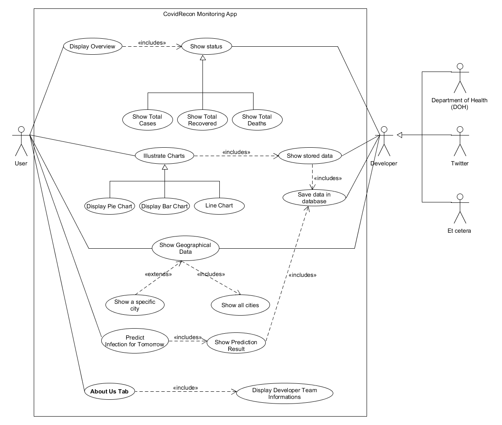
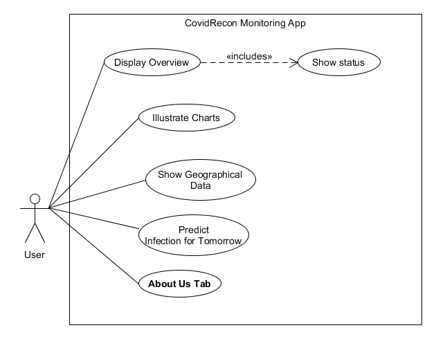
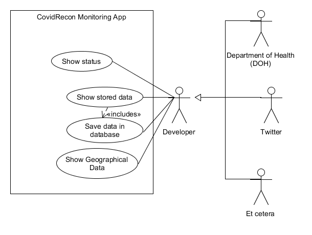
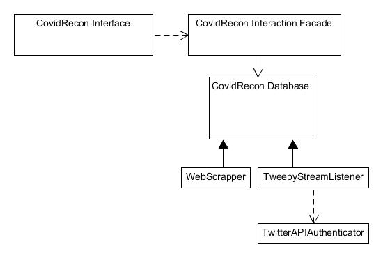

# [Project-CovidRecon](https://vppexis.github.io/CPE106L-ProjectCovidRecon/)

### Project Members
    1. 
    2.
    3.
    4.
    5.
    6.

### Requirements
- Python 3.7
- PyQT5
- Tweepy

### Running the Program
1. Install al the requirements
2. Run in terminal 'python main.py'

 
 

# Project Documentation

Written by: Laurence Kobe Navarro, Claudee Directo & Cedrick Cinco

# Introduction
Data Science and mathematical models can help in shedding light on the evolution of the novel Coronavirus pandemic. By predicting, visualizing, and analyzing the virus, we will be able to put up an immunity against it through the help of data and information. This is an application that can forecast real-time COVID-19 data that can fill the gap between users and various sources of information in order to produce reliable data.  As the world plunged into a pandemic caused by COVID-19, both technology and medical field tries to understand how the virus had spread exponentially across the globe as well as on how to cure it. As people get wary about the health implications this pandemic poses on their health, economic, and social activity – they also want to gain information. However, to this day, there isn't a well-centered outlet to get data visualization and prediction of COVID-19, false information might constitute to the delay of the dissection of current data. With this application, it aims to bridge the user and the different sources of data that could visualize it for beneficiaries – not just for the people, but for health workers, and even for the common knowledge of the government. It delivers visualized data, its analysis, and the prediction of the movement of the virus. 

## Purpose
The purpose of the program is as follows:
    
* To gather COVID-19 data cases and its location
    
*  To visualize the data into charts.
    
* To predict the logarithmic and exponential pattern
    
* To show the geographical status of each province.

## Scope
The scope of this software is limited to the Philippines. To be specific the NCR Region and its cities only since the data is readily available due to the different sources and the increase of production of test kits. The software does not gather the user's data since it does not need it. The software will only gather source from 

## Definitions, Acronyms, and Abbreviations
* **Tweepy** – Tweepy is a Python library to access the Twitter API. It is usually used for simple automation and creating twitter function and bots. With Tweepy, developers can accumulate tweets, create and delete tweets, and follow or unfollow users. 
    
* **Twitter API** – The Twitter API allows the access and use of Twitter without having to go through its interface. This access is helpful when performing various automated tasks such as collecting tweets through writing a series of script codes. 
    
* **RDS** – RDS or Relational Database Service 

## Reference 
The Software Design Document is divided into 11 sections with various subsections. The sections of the Software 
    
Design Document is:
1. Introduction
2. Use Cases
3. Design Overview
4. System Object Model
5. Object Descriptions
6. Object Collaborations
7. Data Design
8. Dynamic Model
9. Non-function Requirements
Supplementary Documentation    

## Overview

# Use Cases

## Actors
1. **Customer User** - The customer is the user who uses or benefit from the software application. This is an abstraction or generalization of the users as they all perform similar actions but for different reasons. The actions that they may perform are: (1) to show or display the overview of the status of COVID-19 in Metro Manila, (2) visualize the data into charts for demonstrating the relationships, increments, and decrements as well as the patterns in each data points through a pie chart, bar chart and line charts, (3) show the geographical location of the cases in Metro Manila by the whole region or a specific city, (4) and predict the number of cases/growth through logarithmic and exponential models.

2. **Software Developer** - 

## List of Use Case
* Customer Use Cases
    - Display Status (Overview)
        - Show Total Cases
        - Show Total Deaths
        - Show Total Recovered

    - Visualize Data through Charts (Details)
        - Display Pie Chart(Detail)
        - Display Bar Chart(Detail)
        - Display Line Chart(Detail)

    - Show Geographical Location of Data (Overview)
        - Show all cities (Detail)
        - Show a specify city (Detail)

    - Predict Information
        - Exponential Model (Detail)
        - Logarithmic Model (Detail)

    - Display Developer Team Informations (Detail)

## Use Case Diagram
* CovidRecon Monitoring App - Entire Use Cases in the Software Application

* Customer - Essential Use Cases

* Software Developer - Essential Use Cases

## Use Cases
* Customer Use Cases: Display (Overview)

    | **Use case name**: Display Status (Overview)  | **ID**: DO                | **Priority**: High  |   |   |
    |-------------------------------------------|-----------------------|-----------------|---|---|
    | **Primary Actor**: Customer (Client)          | **Use Case Type**: System | **Level**: Overview |   |   |

    **_Brief Description_**
    
    This use case describes the main interface of the software application in a workflow. It shows the current status and the percentile of the total number of the case, the total number of deaths and the total number of recovered patients limited only in the National Capital Region (NCR) in the Philippines. The cities covered in the statistical overview in this window are Manila, Quezon City, Caloocan, Las Piñas, Makati, Malabon, Mandaluyong, Marikina, Muntinlupa, Navotas, Parañaque, Pasay, Pasig, San Juan, Taguig, and Valenzuela. The data stored in the database reflects in this use case since all of the information regarding the latest number of COVID-19 patients is updated from time to time through scraping.

    **_Goal_**

    To deliver the latest statistical number of COVID-19 patients in Metro Manila accurately and precisely to the client with a friendly interface.

    **_Sucess Measurement:_**

    The main interface will be rated and we ask for feedback by the user for the maintenance and improvement of the application and verify if it is acceptable for public use.

    **_Precondition:_**

    - The Display Status (Overview) has successfully passed through verification and authorization.

    - The statistical number of the Coronavirus Disease 2019 (COVID-19) is accurate in accordance with the official announcement of the Department of Health (DOH) and other authorized and credible sources on Twitter. The data extraction from Twitter will be used to draw and generate the results in the main interface of the application.

    **_Relationships:_**
    
    - Includes: _Show Status: Show Cases, Show Recoved, Show Deaths_
    - Extend: None
    - Depends on: None

    **_Typical Flow of Events:_**

    1. A window is generated and has the main window.
    2. The data is pulled from the database for display.
    3. The user views the data and provides feedback to the developers.

    **_Assumptions:_**
    
    1. It is assumed that the data used is up to date for the day.

    **_Implementation Constraints and Specifications:_**
    
    * Insert here

* Customer Use Cases Illustrate Charts (Details)
    
    | **Use case name**: Illustrate Charts (Details)  | **ID**: IC               | **Priority**: Medium  |   |   |
    |-------------------------------------------|-----------------------|-----------------|---|---|
    | **Primary Actor**: Customer (Client)          | **Use Case Type**: System | **Level**: Detail |   |   |

    **_Brief Descriptions:_**
    
    This use case is a visual representation of the Display Status use case. It shows case also the number of cases, recovered, and deaths of COVID – 19 cases through a Pie chart, Bar chart, Line Chart. The charts are renewed from time to time through the web scraping of the developers to update the database.

    **_Goal_**

    To be able to use the data and show case into an accurate visual representation of the data.

    **_Sucess Measurement:_**

    The charts are generated depending on what the user wanted and thru proper feedback if the charts are accurate for viewing.

    **_Precondition:_**

    The user choose to view the illustrate chart feature of the application

    **_Trigger:_**

    The user clicked the illustrate chart button

    **_Relationships:_**
    - Includes: show stored data
    - Extend: None
    - Depends on: None

    **_Typical Flow of Events:_**
    1.  A window is generated while hiding the main window.
	2.  The data from it is pulled into the window to make a chart.
	3.  The User choose which kind of chart the user wants to see for the visual representation.
    4.  The User gives feedback if the data is accurate or not to provide a better experience of the app.

    **_Assumption_**
    1.  It is assumed that the data is up to date with web scraping from the sources of information for the creation of charts. 
    2.  It is assumed that the data used is the same as the one in the Status for the generation of charts.

    **_Implementation Constraints and Specifications_**
    - Insert Here

* Customer Use Cases: Show Geographical Data (Details)

    | **Use case name**: Show Graphical Data (Details)  | **ID**: SGD               | **Priority**: Medium  |   |   |
    |-------------------------------------------|-----------------------|-----------------|---|---|
    | **Primary Actor**: Customer (Client)          | **Use Case Type**: System | **Level**: Detail |   |   |

    **_Brief Descriptions:_**

    This use case is also a visual representation of the Data. The difference is the showcasing of the data using the map of the NCR. There is a feature which is show cases the status of the city on COVID-19 cases. 

    **_Goal_**
    
    The successful generation of the map representation of the data as a whole region, and individual cities.

    **_Sucess Measurement:_**

    The geographical map data is reviewed by the user as acceptable for use. 

    **_Precondition:_**

    The data is sufficient enough to show case the number of cases on COVID-19

    **_Trigger:_**
    
    The user clicked the show geographical data button

    **_Relationships:_**

    - Includes: Show all cities.
	- Extend: Show a specific city.
    - Depends on: None

    **_Typical Flow of Events:_**

    1.  A window is generated while hiding the main window.
	2.  The data from the database is pulled for creation of the geographical map.
	3.  A representation of the NCR is shown in the window.
    4.  The User is given an option to choose a city and view the status of it which will generate another geographical map for it.

    **_Assumption_** 
    
    
    **_Implementation Constraints and Specifications_**
    
    - Insert Here

* Predict Infection for Tomorrow (Details)

    | **Use case name**: Predict Infection for Tomorrow  | **ID**: PIT               | **Priority**: High  |   |   |
    |-------------------------------------------|-----------------------|-----------------|---|---|
    | **Primary Actor**: Customer (Client)          | **Use Case Type**: System | **Level**: Detail |   |   |

    **_Brief Descriptions:_**

    This use case is where the data from the web scraping has been calculated for an accurate prediction of the increase or decrease of cases of the whole NCR region.

    **_Goal_**

    The prediction results is shown in the window. 

    **_Sucess Measurement:_**

    The data from the previous data is done and been used as a basis to understand, if the prediction is close or off by how much percentile.

    **_Precondition:_**

    The data is sufficient enough to be used for a prediction of the increase or decrease of cases.

    **_Trigger:_**

    The user clicked the Prediction for Infection Tomorrow button

    **_Relationships:_**

    - Includes: Show Prediction result
	- Extend: None
    - Depends on: Non

    **_Typical Flow of Events:_**

    1.  A window is generated while hiding the main window.
	2.  The data from the database is pulled from the data from present day.
	3.  Using a formula, a process in the background calculates the cases of people for tomorrow.
    4.  The prediction result is shown in the window. The user is given a chance to provide feedback if the result will be accurate or not.

    **_Assumption Constraints and Specifications_**

    1. It is assumed that the formula correctly predicts the results for tomorrow.
    2. It is assumed that the data for the calculation of prediction is sufficient enough.

* Customer Use Cases: About Us (Details)

    | **Use case name**: About Us (Details)  | **ID**: AU               | **Priority**: Medium  |   |   |
    |-------------------------------------------|-----------------------|-----------------|---|---|
    | **Primary Actor**: Customer (Client)          | **Use Case Type**: System | **Level**: Detail |   |   |

    **_Brief Descriptions:_**
    
    This use case is where the information shown about the people who worked and helped developed the project. This includes a contact information for feedback and improvements for the application

    **_Goal_**

    To provide contact information and details about the project.

    **_Sucess Measurement:_**

    The information of each individual member and developer is present on the window.

    **_Precondition:_**

    - 

    **_Trigger:_**
    
    The user clicked the Prediction for About Us button

    **_Relationships:_**

    - Includes: Display Developer Team Information
    - Extend: None
    - Depends on: Non

    **_Typical Flow of Events:_**

    1.  A window is generated while hiding the main window.
    2.  The  information of each developer is displayed.

    **_Assumption_**

    It is assumed that the data about the developer is updated.
    
    **_Implementation Constraints and Specifications_**

    - Insert Here

# Design Overview

## Introduction

In this section, we will discuss the design overview of the application. The application will have an Interface, Interaction, Database, WebScrapper, StreamListener, and IOAuthenticator. The Interface is the main control of the application where the user can interact with the software through the interaction façade. Thus, access to the database. Furthermore, the database can be modified by both the WebScrapper and TweppyStreamListener which can use the TwitterAPIAuthenticator to authenticate the API.

## System Architecture

## System Interfaces
- **User Interfaces**

The user interface for the system allows the user to get the latest updates regarding the COVID-19 cases in the NCR Region. The user can also access and visualize the data regarding the COVID-19 in the NCR region. It also shows a graph of the progress of the COVID-19 in the NCR. Lastly, it also shows the cases per each city in the NCR. The interface has buttons according to the data it needs to visualize. This allows for ease of navigation using only the mouse.

- **Software Interfaces**

## Constraints and Assumptions

- **List Assumptions**
    
    1. It assumed that the database is in MySQL format.

- **List of Dependencies**

    1. This application does requires python3 to run and libraries to conduct its functionality such as pyqt, tweepy, pandas, and many more.

# System Object Model

